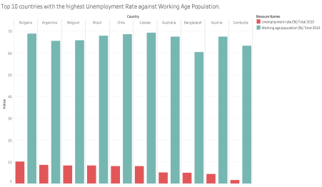
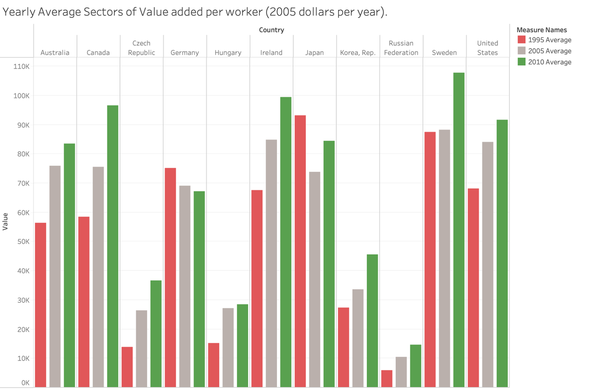
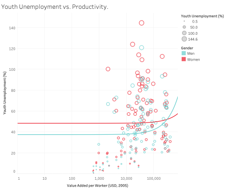
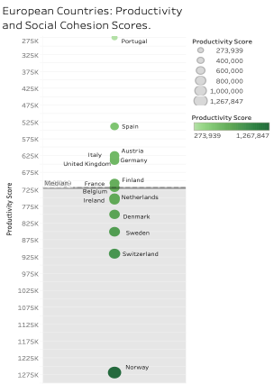

# Data Visualisation - World Bank Analysis

## Overview

A comprehensive Tableau-based analysis of World Bank datasets exploring socioeconomic trends across 156 countries. This project demonstrates advanced data visualization techniques to uncover patterns in gender participation, economic productivity, migration, education, and unemployment.

**Key Dataset:** World Bank Socioeconomic Indicators (1995-2010)  
**Tool:** Tableau  
**Analysis Scope:** 156 countries across 10+ socioeconomic indicators

---

## Key Findings

- **Gender Gap in Labour:** Men consistently show higher workforce participation rates than women across most countries, particularly in developing nations. Countries like Mauritania demonstrate that gender-equitable policies can narrow this gap.

- **Productivity Correlation:** Advanced economies (Japan, Sweden, USA) maintain high productivity levels ($600K+ per worker), while emerging markets (Czech Republic, South Korea) show rapid productivity growth, indicating effective economic reforms.

- **Migration & Remittances:** Remittances play a critical role in GDP for countries with significant immigrant populations (e.g., Armenia). Migration patterns reveal the relationship between labour mobility and economic development.

- **Education-Employment Link:** Strong correlation exists between average schooling years and labour market availability. Regions with higher education levels exhibit lower skill constraints.

- **Youth Unemployment Crisis:** Young people face disproportionately high unemployment rates, especially young women. This skills-job imbalance requires targeted education and training interventions.

---

## Analysis Methodology

This analysis employs multiple Tableau visualization techniques to explore World Bank data:

- **Bar Charts** - Comparative analysis of gender participation rates and unemployment trends
- **Heat Maps** - Migration patterns and economic impacts across countries
- **Geographic Maps** - Global education levels and skill constraints visualization
- **Line Charts** - Temporal trends in labour participation over 15 years
- **Scatter Plots** - Relationship analysis between youth unemployment and productivity
- **Bubble Charts** - Educational and employment exclusion patterns by gender
- **Tree Maps** - Policy effectiveness across countries and categories
- **Box & Whiskers Plots** - Productivity and social cohesion score distributions

---

## Visualizations

### Bar Charts

**Figure 10: Average Participation Rate for Women vs Men ages (15-24) in 2010 by country**

Gender differences are stark, with men typically having higher participation rates. Mauritania stands out with 82.80% female participation (vs 81.30% male), showing that gender-equitable policies work. Timor-Leste shows the widest gap (17.50% men vs 7.70% women), highlighting urgent policy needs in developing regions. Developed countries like those in North America and Europe have higher average participation rates for both genders due to more inclusive labour markets and better access to education.

---

**Figure 11: Top 10 Countries with the Highest Unemployment Rate against Working Age Population in 2010**

Bulgaria leads with 10.20% unemployment despite a significant working-age population. European nations dominate this list, indicating that even developed economies struggle with unemployment. The disparity between workforce supply and job availability suggests structural economic challenges requiring targeted interventions.

---

**Figure 12: Yearly Average Value Added Per Worker**

Productivity trends from 1995-2010 reveal a two-tier global economy. Developed nations (Japan $600K+, Sweden, USA) set the standard, while emerging markets like the Czech Republic and South Korea show significant catch-up growth, demonstrating the impact of education, technology, and infrastructure investments.

---

### Heat Map Visualization

**Figure 13: Average Migration and Economic Impact for Top 30 countries**

This visualization reveals the intricate relationship between migration flows and economic outcomes. Countries like Armenia and Belize show disproportionately high immigrant populations relative to their native populations. Remittances emerge as a critical economic lifeline, particularly in countries with significant diaspora communities, representing substantial portions of national GDP.

---

### Map Visualization

**Figure 14: Compares the Average School Years (2010), Skills Constraints (2010) and predicted Educational Attainment for (2010) using (2009) data**

A global education landscape emerges: darker regions (North America, Europe, East Asia) show higher average schooling years and lower skill constraints. Conversely, lighter regions (Africa, South Asia) reveal lower educational investment and higher skill gaps. This visualization underscores the critical link between education investment and labour market readiness. The associated bars demonstrate that areas with higher levels of education typically have less skill constraints.

---

### Line Chart

**Figure 15: Trends in Labour Force Participation by Gender and Age Group between 1995 and 2010**

Over 15 years, female participation (ages 25-64) shows an upward trajectory, reflecting improved educational access and shifting social norms. Younger cohorts (15-24) maintain lower participation due to school enrollment. The persistent gender gap across all age groups highlights the need for continued policy focus on female workforce integration.

---

### Scatter Plot

**Figure 16: Total Youth Unemployment (%) vs Total Value Added per Worker**

A clear inverse relationship emerges: youth unemployment is typically higher in countries with lower productivity. Young women face particularly acute challenges, experiencing higher unemployment rates than young men across most economies. This suggests compounding effects of both economic development and gender discrimination.

---

### Bubble Chart

**Figure 17: Comparison of Total Youths Not in School or at Work (%) by Gender and Year in Top 15 countries**

South and Southeast Asian countries dominate this visualization, with India, Indonesia, and Pakistan showing alarming rates of youth exclusion from both education and employment. Women experience significantly higher exclusion than men. While some countries (Bulgaria, Kazakhstan) show progress, others (India) remain entrenched, suggesting persistent structural barriers requiring comprehensive policy intervention.

---

### Tree Map

**Figure 18: Visualization of the Top 10 Policy Scores by Category and Country, with the productivity levels being represented by the colour**

Strong policy frameworks correlate directly with higher productivity. Northern European countries excel across categories (labour market regulations, social security contributions), while countries with weaker policy frameworks lag. This visualization demonstrates that economic efficiency depends on comprehensive, well-designed policy ecosystems.

---

### Box & Whiskers Plot

**Figure 19: Productivity and social cohesion scores for selected European countries, with colour intensity representing productivity levels and bubble size indicating score magnitude**

European economies display varying success in balancing productivity with social cohesion. Finland and Switzerland lead in both metrics, while Portugal and Spain show development potential. Denmark and Ireland exemplify sustainable models integrating strong economic performance with robust social systems—a model worthy of broader adoption.

---

## Business & Research Impact

This analysis reveals critical insights for policymakers:

1. **Gender equality drives economic participation** - Regions with gender-equitable policies show higher overall labour participation and productivity.

2. **Education is the foundation** - Strong correlation between educational investment and labour market efficiency suggests education should be a policy priority.

3. **Youth employment requires immediate attention** - The skills-job mismatch among youth demands coordinated education-industry partnerships.

4. **Migration offers untapped potential** - Remittances and skilled migration can significantly boost development when properly managed.

5. **Policy quality matters** - Countries with comprehensive policy frameworks demonstrate superior economic outcomes across multiple dimensions.

---

## Data Insights & Recommendations

- **For Developing Nations:** Prioritize education infrastructure and gender-inclusive labour policies to accelerate productivity catch-up with developed economies.

- **For Youth Employment:** Establish vocational training programs aligned with labour market demands to bridge the education-jobs gap.

- **For Gender Equality:** Implement targeted policies supporting female workforce participation; evidence shows immediate positive economic returns.

- **For Migration Policy:** Design frameworks that harness remittances and skilled labour mobility as development tools rather than viewing migration as a cost.

---

## Limitations & Future Work

- **Data Recency:** Analysis covers 1995-2010; contemporary data would reveal post-financial crisis trends
- **Granularity:** Country-level analysis masks important regional variations within nations
- **Causality:** Correlations shown do not imply causation; deeper qualitative research needed
- **Future Enhancements:** 
  - Predictive models forecasting 2025-2030 employment trends
  - Intersectional analysis examining overlapping inequalities
  - Real-time data integration for ongoing monitoring

---

## Technical Details

- **Data Source:** World Bank Open Data
- **Visualization Tool:** Tableau
- **Analysis Period:** 1995-2010
- **Countries Analyzed:** 156
- **Indicators:** 10+ socioeconomic dimensions

---

*This project demonstrates the power of data visualization in transforming complex socioeconomic datasets into actionable insights for policy and research.*

---

**Author**: Adunoluwa Oguntuga  
**Date**: 2025  
**Data Source**: World Bank Open Data  
**License**: MIT  
