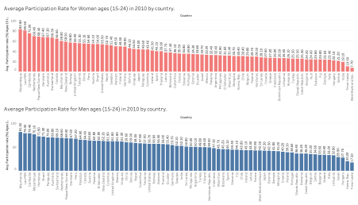
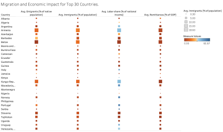
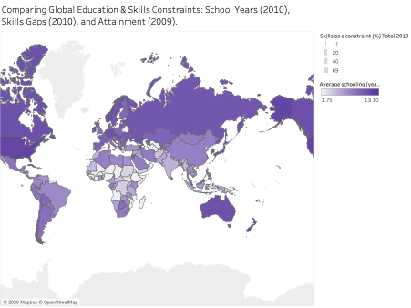
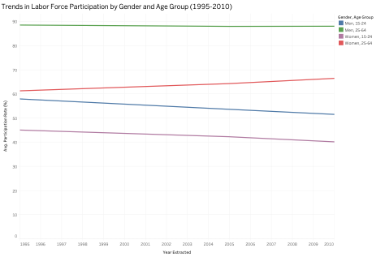
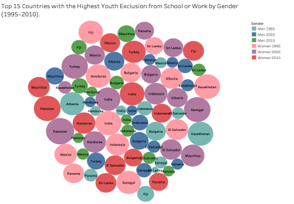
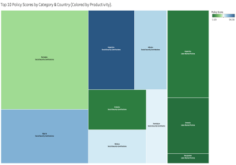

# 🌍 Data Visualisation in Research — World Bank Tableau Analysis

This project explores how data visualisation enhances research insight and communication, using World Bank datasets to analyze **global gender participation, education, and economic productivity**.  
Developed as part of an academic research module, the report combines theory, applied Tableau dashboards, and statistical reasoning to demonstrate how effective visual storytelling can drive understanding and decision-making.

---

## 🎯 Objectives
- Investigate the purpose and evolution of data visualisation in research.
- Compare 2D, 3D, and interactive methods for communicating complex data.
- Use Tableau to uncover global trends in gender participation, migration, and productivity.

---

## 🧠 Tools & Skills
- **Tools:** Tableau (data cleaning), Microsoft Excel  
- **Skills:** Data storytelling, statistical reasoning, dashboard design, data communication, academic research (Harvard style)

---

## 📊 Visual Highlights

Below are selected visualisations from the Tableau analysis:

**Figure 10 — Gender Participation Rate by Country**  

**Figure 13 — Migration vs Economic Impact (Heat Map)**  

**Figure 14 — Education and Skills by Region (Map)**  

**Figure 15 — Labour Force Participation Over Time**  

**Figure 17 — Youth Exclusion vs GDP (Bubble Chart)**  

**Figure 18 — Economic Growth Factors (Tree Map)**  

📂 *Additional visualisations are available in the [`/dashboard`](./dashboard) folder.*

---

## 📘 Full Report
The complete academic report (including analysis and references) is available in the [`/reports`](./reports) folder.  

> *Coursework completed as part of the BSc (Hons) Computer Science program at Liverpool John Moores University.*

---

